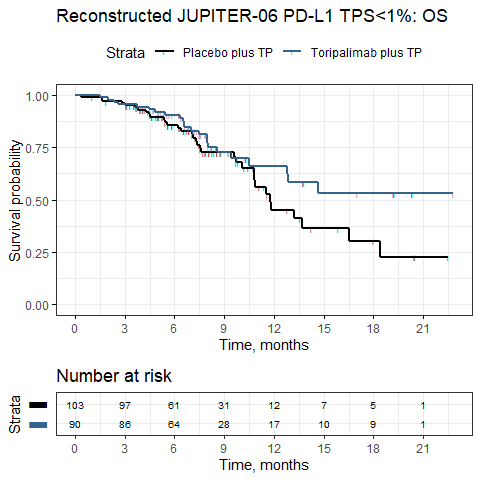
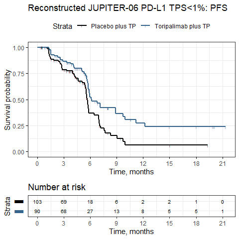
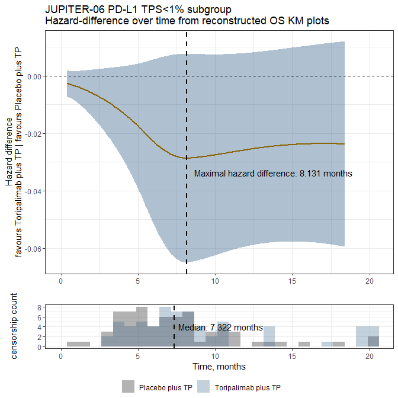
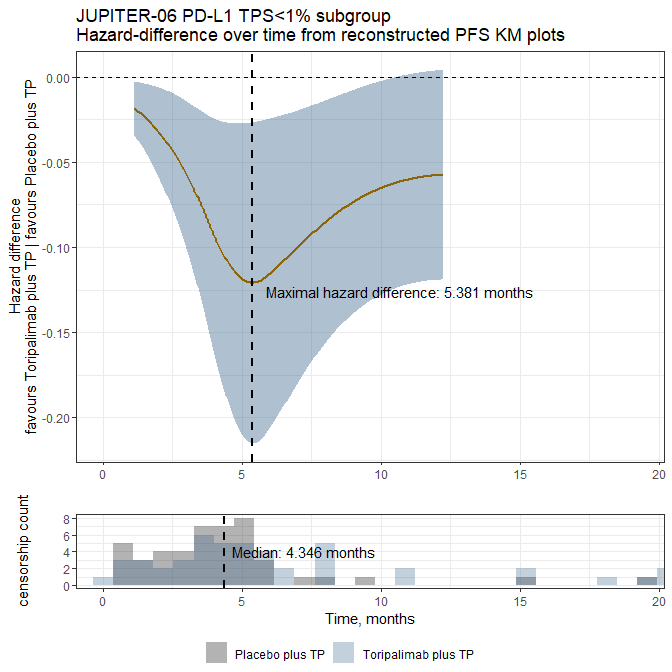

JUPITER-06 PD-L1 TPS \<1% subgroup analysis
================
Joseph J Zhao, Filippo Pietrantonio, Raghav Sundar
15/2/2023

### Reply to Gao *et al*

Original article: Yap, D. W. T. *et al*. Effectiveness of Immune
Checkpoint Inhibitors in Patients With Advanced Esophageal Squamous Cell
Carcinoma: A Meta-analysis Including Low PD-L1 Subgroups. JAMA Oncology,
<doi:10.1001/jamaoncol.2022.5816> (2022).

### Load packages

``` r
package.name=c(# data reconstruction
  "IPDfromKM",
  # data manipulation
  "tidyverse", "readr", "readxl", "dplyr", "tidyr", "lubridate", "tibble", "plyr", "devtools", "stringr", "stringi",
  # survival analysis
  "survminer", "survival", "rstpm2", "survRM2", "prodlim",
  # plotting
  "ggplot2"
)

for (package.name in package.name){
  tryCatch(
  {
  if (!require(package.name, character.only = TRUE)){ 
    install.packages(package.name, character.only = TRUE) 
    library(package.name, character.only = TRUE)} else {library(package.name, character.only = TRUE)}
  }, 
    error=function(e){cat("ERROR :",conditionMessage(e), "\n")})
}
```

### Set working directory

``` r
wd="C:/Users/jzhao/OneDrive/Research_Cloud/NUH_NCIS/pdl1_escc_kms/"
setwd(wd)

dir.create(paste(wd,"output/", Sys.Date(), sep=""))
setwd(paste(wd, "output/",Sys.Date(), sep="") )
```

### Load reconstructed time-to-event data of JUPITER-06 PD-L1 TPS \<1% subgroups reported by Wu *et al* (figures 1B &D)

Reconstruction of survival data was conducted separately with the
*IPDfromKM* package.

Reference: Wu, H. X. *et al*. Clinical Benefit of First-Line Programmed
Death-1 Antibody Plus Chemotherapy in Low Programmed Cell Death Ligand
1-Expressing Esophageal Squamous Cell Carcinoma: A Post Hoc Analysis of
JUPITER-06 and Meta-Analysis. J Clin Oncol, Jco2201490,
<doi:10.1200/jco.22.01490> (2022).

``` r
files <- list.files(path = paste0(wd, "data/recon/"), pattern = paste(".csv",sep=""), full.names = T)
df <- sapply(files, read_csv, simplify=F) %>% 
          bind_rows(.id = "id") %>% 
          select(time, status, arm, outcome)

head(df)
```

    ## # A tibble: 6 x 4
    ##    time status arm             outcome
    ##   <dbl>  <dbl> <chr>           <chr>  
    ## 1 0.340      1 Placebo plus TP OS     
    ## 2 1.04       0 Placebo plus TP OS     
    ## 3 1.62       1 Placebo plus TP OS     
    ## 4 1.66       1 Placebo plus TP OS     
    ## 5 1.86       0 Placebo plus TP OS     
    ## 6 2.82       1 Placebo plus TP OS

### Compare reconstructed KM plots to original plots

``` r
for (i.outcome in unique(df$outcome)){
  
  cox=coxph(Surv(time, status)~arm, data=subset(df, df$outcome==i.outcome))
  sum.cox=summary(cox)
  
  km=survfit(Surv(time, status)~arm, data=subset(df, df$outcome==i.outcome))
  
  plot_km = ggsurvplot(km,
                      data = subset(df, df$outcome==i.outcome), 
                      size=0.8,
                      risk.table = TRUE,    
                      censor.shape="|",
                      censor.size = 1.2,
                      palette = c("black","steelblue4"),
                      xlim = c(0,max(subset(df, df$outcome==i.outcome)$time)),
                      xlab = "Time, months",
                      break.time.by = 3,   
                      ggtheme = theme_bw(),
                      risk.table.y.text = F,
                      ncensor.plot = T,     
                      risk.table.fontsize=2.7,
                      legend.labs = (cox$xlevels$arm),
                      title=paste0("Reconstructed JUPITER-06 PD-L1 TPS<1%: ", i.outcome)
                      )
  
  print(plot_km)
}
```

<!-- --><!-- -->

### Calculate follow-up time with reverse KM method with the *prodlim* package

``` r
quantile(prodlim(Hist(time=time, event=status)~arm, data=subset(df, df$outcome=="OS"), reverse=TRUE))
```

    ## Quantiles of the potential follow up time distribution based on the Kaplan-Meier method 
    ## applied to the censored times reversing the roles of event status and censored.
    ## 
    ## Table of quantiles and corresponding confidence limits:
    ## 
    ##  arm=Placebo plus TP 
    ## 
    ##      q quantile lower upper
    ## 1 0.00       NA    NA    NA
    ## 2 0.25     12.8  10.4  18.0
    ## 3 0.50      8.1   7.1   9.7
    ## 4 0.75      5.3   4.6   6.6
    ## 5 1.00      1.0   1.0   3.2
    ## Median time (IQR):8.06 (5.28;12.80)
    ## 
    ## Table of quantiles and corresponding confidence limits:
    ## 
    ##  arm=Toripalimab plus TP 
    ## 
    ##      q quantile lower upper
    ## 1 0.00       NA    NA    NA
    ## 2 0.25     13.8  10.3  19.2
    ## 3 0.50      8.3   7.6   9.8
    ## 4 0.75      6.4   5.3   7.2
    ## 5 1.00      3.1   3.1   3.7
    ## Median time (IQR):8.27 (6.42;13.76)

### Evaluate for PH assumption with the Grambsch-Therneau test and plotted Schoenfeld residuals

``` r
for (i.outcome in unique(df$outcome)){print(ggcoxzph(cox.zph(coxph(Surv(time, status)~arm, data=subset(df, df$outcome==i.outcome))), title=i.outcome))}
```

<!-- --><!-- -->

### Time-varying analysis

``` r
for (i.outcome in unique(df$outcome)){
  
  df_temp=subset(df, df$outcome==i.outcome)
  df_temp$arm=ifelse(df_temp$arm=="Placebo plus TP", 0, 1)
  
  # fit model for stpm2
  fit=stpm2(Surv(time, status) ~ arm, data=df_temp,  df=5)
  pred=predict(fit, newdata=data.frame(arm=0), type="rmstdiff", var="arm", grid=TRUE, full=TRUE, se.fit=TRUE)
  
  plot_timevar=ggplot(pred, aes(x=time, y=Estimate, ymin=lower, ymax=upper)) +
            geom_ribbon(alpha=0.4, fill="steelblue4") +
            geom_line(size=1, color="darkgoldenrod4")+
            theme(plot.title= element_text(face="bold", size=14), axis.text=element_text(color="black"))+
            theme_bw()+
            geom_hline(yintercept=0, linetype="dashed")+
            labs(color="black", x = "Time, months", y = "Restricted mean survival time difference", 
                 title = paste0("JUPITER-06 PD-L1 TPS<1% subgroup\nTime-varying RMST-differences from reconstructed ", i.outcome, " KM plots"), face="bold")
  
  
  print(plot_timevar)
    
}
```

<!-- --><!-- -->
